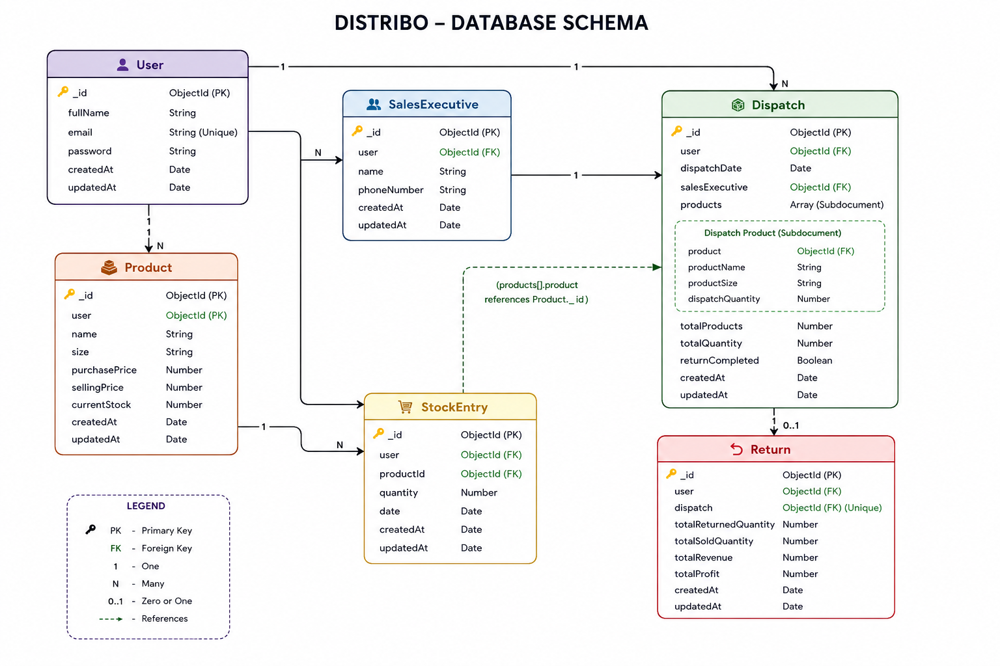

# Distribo - Distribution Operations Platform

A full-stack MERN application designed to simplify distribution operations for small businesses.

[🚀 Live Demo](https://distribo-live.vercel.app)

## Real World Problem
The idea for Distribo came from observing a local beverage distributor who purchases products from manufacturers or suppliers and distributes them to:
- 🏪 Retail Shops
- 🍽️ Restaurants
- 🏨 Hotels
- 🛒 Supermarkets

The distributor managed daily operations manually using notebooks, paper invoices, and calculators to record inventory, dispatches, returns, and sales.As the business grew, this manual process became increasingly time-consuming and often resulted in calculation errors, stock mismatches, and difficulties in maintaining accurate records.

This observation inspired the development of Distribo—a web-based Distribution Management System that digitizes these day-to-day operations and provides a faster, more organized, and reliable way to manage inventory and distribution.

### Problems Identified

- 📦 Manual inventory and stock management
- 🧮 Time-consuming sales and profit calculations
- 🚚 No centralized dispatch tracking
- ↩️ Difficulty managing returned products
- 📊 Lack of business reports and analytics
- 🗂️ Hard to maintain and retrieve historical records


## How Distribo Solves These Problems
- Manage products and inventory
- Track product dispatches
- Record product returns
- Automatically calculate sales and profit
- Generate business reports
- Visualize key metrics through an interactive dashboard

## Features

- User Registration & Login (JWT Authentication)
- Product Management
- Stock Management
- Sales Executive Management
- Dispatch Management
- Return Management
- Dashboard Analytics
- Reports
- User Profile

## Tech Stack

### Frontend
- React
- Vite
- Tailwind CSS
- Axios
- React Router

### Backend
- Node.js
- Express.js
- MongoDB Atlas
- Mongoose
- JWT Authentication


## 🎥 Project Workflow

The following workflow demonstrates how **Distribo** streamlines the complete distribution process, from user authentication to business reporting.

1. **Register** – Create a new distributor account to access the platform.
2. **Login** – Securely sign in to the system.
3. **Dashboard** – View an overview of inventory, sales, and business activities.
4. **Inventory Setup** – Add products with their details and initial stock.
5. **Add Stock** – Record newly received stock in the warehouse.
6. **Dispatch Stock** – Assign and dispatch products to sales executives.
7. **Warehouse Stock Reduced** – The warehouse inventory is automatically updated after dispatch.
8. **Sales Executive Sells Products** – Sales executives deliver and sell products to retailers.
9. **Return Entry** – Record unsold or returned products received back into the warehouse.
10. **Sales Calculation** – Calculate the total value of products sold.
11. **Revenue Calculation** – Determine the total revenue generated from sales.
12. **Profit Calculation** – Calculate business profit based on purchase and selling prices.
13. **Generate Reports** – View comprehensive reports for inventory, sales, revenue, and profit.
14. **Logout** – Securely end the current user session.

📹 **Project Demo:** [Watch the complete workflow video](https://youtu.be/eBm4xXzYQ4I)

## Installation

### Clone Repository

```bash
git clone https://github.com/SudharshanChejarla/distribo.git
cd Distribo

```

### Backend

```bash
cd backend
npm install
npm run dev
```

### Frontend

```bash
cd frontend
npm install
npm run dev
```

## Environment Variables

Backend (.env)

```
PORT=5000
MONGO_URI=your_mongodb_connection_string
JWT_SECRET=your_secret
```

Frontend (.env)

```
VITE_API_URL=http://localhost:5000/api
```
## Database Schema



## System Architecture

Distribo follows a client-server architecture, where the React frontend communicates with a Node.js/Express backend through REST APIs. The backend handles authentication, business logic, and database operations using MongoDB.

```text
Distribo
├── frontend/
│   ├── src/
│   │   ├── api/               # Axios configuration
│   │   ├── assets/            # Images & static assets
│   │   ├── components/        # Reusable UI components
│   │   ├── pages/             # Feature-based pages
│   │   │   ├── auth/
│   │   │   ├── dashboard/
│   │   │   ├── inventory/
│   │   │   ├── dispatch/
│   │   │   ├── returnSales/
│   │   │   ├── salesExecutive/
│   │   │   ├── report/
│   │   │   └── profile/
│   │   ├── routes/            # Route configuration
│   │   ├── services/          # API service layer
│   │   └── utils/             # Utility functions
│   └── package.json
│
├── backend/
│   ├── config/                # Database configuration
│   ├── controllers/           # Business logic
│   ├── middleware/            # JWT authentication & middleware
│   ├── models/                # MongoDB models
│   ├── routes/                # REST API routes
│   ├── index.js               # Server entry point
│   └── package.json
│
└── README.md
```


## Future Improvements

- **Role-Based Access Control (RBAC):** Introduce multiple user roles such as Admin, Manager, and Sales Executive with role-specific permissions.

- **Google OAuth Authentication:** Integrate Google Sign-In using OAuth 2.0 to allow users to authenticate securely without creating a separate password.

- **Advanced Reports & Analytics:** Add interactive charts, sales trends, inventory analysis, and downloadable PDF/Excel reports.

- **Search, Filter & Pagination:** Improve data management with advanced search, filtering, sorting, and pagination.

- **Mobile Responsive Enhancements:** Further optimize the interface for tablets and smartphones used by field sales executives.


## Author

Sudharshan Chejarla